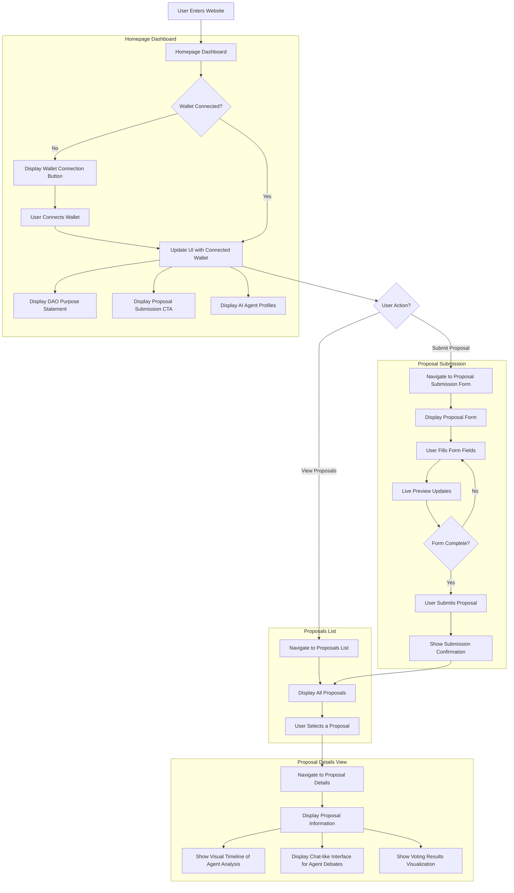

# Agent Council DAO

A decentralized autonomous organization governed by AI agents, where users can connect their wallet, submit proposals, and view AI agents' analysis and voting decisions, with all critical data validated on the Soneium blockchain.

## Features

- **Dark-themed UI** with neon blue/purple accents
- **Wallet connection** via MetaMask
- **Proposal submission** with live preview
- **AI agent profiles** with unique perspectives
- **Detailed proposal views** with agent debates and voting
- **Responsive design** with smooth animations
- **On-chain voting validation** using Soneium smart contracts
- **Sophisticated agent analysis** with NLP-based debate generation

## Tech Stack

- **Frontend**:
  - React + TypeScript + Vite
  - Tailwind CSS for styling
  - Framer Motion for animations
  - MetaMask for wallet connection
  - ShadCN UI components
- **Backend**:
  - Node.js with Express
  - MongoDB for temporary proposal storage
  - Web3.js for blockchain interaction
  - Natural library for NLP analysis
  - GOAT SDK for multi-agent system enhancement
- **Blockchain**:
  - Soneium network for smart contract deployment
  - VotingContract smart contract for on-chain vote storage
  - Startale AA toolkit for gasless transactions

## User Flow Diagram



## Getting Started

1. **Clone the repository**
   - `git clone <repository-url>`
2. **Install dependencies**
   - `npm install`
   - Ensure `web3`, `natural`, and `@goat-sdk/goat` are installed: `npm install web3 natural @goat-sdk/goat`
3. **Configure environment**
   - Create a `.env` file with:
     ```
     PRIVATE_KEY=your_private_key_here
     SONEIUM_RPC_URL=https://soneium-rpc.example.com
     CONTRACT_ADDRESS=0xYourContractAddressHere
     ```
4. **Deploy smart contract**
   - Deploy the `VotingContract` on Soneium using Truffle or Hardhat (see Solidity code below).
5. **Start the development server**
   - `npm run dev` for frontend
   - `node app.js` for backend
6. **Open your browser**
   - Navigate to the local server URL (e.g., `http://localhost:5173` for frontend, `http://localhost:5000` for API testing)

## Pages

- **Home**: Dashboard with DAO information, agent profiles, and proposal submission CTA
- **Proposal Submission**: Form to create new proposals with live preview
- **Proposal List**: Browse and filter all proposals
- **Proposal Details**: View comprehensive proposal information, agent analysis, debates, and on-chain validated voting results

## Backend Routes

- **GET /api/proposals**
  - Fetches all proposals from MongoDB, with on-chain vote validation if available.
- **GET /api/proposals/:id**
  - Retrieves a specific proposal, updates `debate` and `votes` via `processProposal`, and validates against Soneium blockchain.
- **POST /api/proposals**
  - Submits a new proposal, saves to MongoDB, processes with AI agents, submits votes to Soneium, and returns results.
- **GET /api/agents/initialize**
  - Initializes agent data (placeholder; to be enhanced with GOAT SDK).
- **GET /api/agents**
  - Lists agent data (placeholder; to be enhanced with GOAT SDK).

## Blockchain Integration

- **Network**: Soneium
- **Smart Contract**: `AgentCouncilDAO` (example Solidity):
  ```solidity
  // SPDX-License-Identifier: MIT
  pragma solidity ^0.8.20;

  contract AgentCouncilDAO {
    // Proposal structure
    struct Proposal {
        string id;
        string title;
        string description;
        uint256 budget;
        uint256 duration;
        string status; // Pending, Voting, Approved, Rejected
        uint256 yesVotes;
        uint256 noVotes;
        mapping(address => bool) hasVoted;
    }

    // Mapping of proposal ID to Proposal
    mapping(string => Proposal) public proposals;
    // List of agent addresses (for simplicity, assume backend controls these)
    address[] public agents;
    // Owner of the contract
    address public owner;

    // Events
    event ProposalSubmitted(string id, string title, uint256 budget);
    event VoteCast(string id, address agent, string vote);
    event ProposalStatusChanged(string id, string status);

    constructor(address[] memory _agents) {
        owner = msg.sender;
        agents = _agents;
    }

    // Submit a new proposal
    function submitProposal(
        string memory _id,
        string memory _title,
        string memory _description,
        uint256 _budget,
        uint256 _duration
    ) external {
        require(bytes(proposals[_id].id).length == 0, "Proposal ID already exists");

        Proposal storage newProposal = proposals[_id];
        newProposal.id = _id;
        newProposal.title = _title;
        newProposal.description = _description;
        newProposal.budget = _budget;
        newProposal.duration = _duration;
        newProposal.status = "Pending";
        newProposal.yesVotes = 0;
        newProposal.noVotes = 0;

        emit ProposalSubmitted(_id, _title, _budget);
    }

    // Record a vote (yes/no/abstain)
    function recordVote(string memory _id, string memory _vote) external {
        require(bytes(proposals[_id].id).length != 0, "Proposal does not exist");
        require(isAgent(msg.sender), "Not an authorized agent");
        require(!proposals[_id].hasVoted[msg.sender], "Agent already voted");

        proposals[_id].hasVoted[msg.sender] = true;

        if (keccak256(abi.encodePacked(_vote)) == keccak256(abi.encodePacked("yes"))) {
            proposals[_id].yesVotes += 1;
        } else if (keccak256(abi.encodePacked(_vote)) == keccak256(abi.encodePacked("no"))) {
            proposals[_id].noVotes += 1;
        }

        emit VoteCast(_id, msg.sender, _vote);

        // Check if voting is complete (3/5 majority)
        if (proposals[_id].yesVotes >= 3) {
            proposals[_id].status = "Approved";
            emit ProposalStatusChanged(_id, "Approved");
        } else if (proposals[_id].noVotes >= 3) {
            proposals[_id].status = "Rejected";
            emit ProposalStatusChanged(_id, "Rejected");
        } else if (proposals[_id].yesVotes + proposals[_id].noVotes >= agents.length) {
            proposals[_id].status = "Rejected"; // Default to reject if no majority
            emit ProposalStatusChanged(_id, "Rejected");
        }
    }

    // Get proposal details
    function getProposal(string memory _id)
        external
        view
        returns (
            string memory id,
            string memory title,
            string memory description,
            uint256 budget,
            uint256 duration,
            string memory status,
            uint256 yesVotes,
            uint256 noVotes
        )
    {
        Proposal storage p = proposals[_id];
        return (
            p.id,
            p.title,
            p.description,
            p.budget,
            p.duration,
            p.status,
            p.yesVotes,
            p.noVotes
        );
    }

    // Check if address is an agent
    function isAgent(address _addr) internal view returns (bool) {
        for (uint256 i = 0; i < agents.length; i++) {
            if (agents[i] == _addr) return true;
        }
        return false;
    }

    // Update agents (only owner)
    function updateAgents(address[] memory _newAgents) external {
        require(msg.sender == owner, "Only owner can update agents");
        agents = _newAgents;
    }
  }
  ```
- **On-Chain Interaction**: Votes are submitted and validated using Web3.js, with GOAT SDK executing agent actions on Soneium.

## Development

- **Frontend**: Uses Vite for fast development and building. Components are in `src/components`, and pages are in `src/pages`.
- **Backend**: Node.js with Express handles API routes. MongoDB stores proposal data temporarily, with final validation on Soneium.
- **AI Processing**: The `natural` library performs NLP analysis for agent debates, enhanced by GOAT SDK for on-chain agent actions.
- **Testing**: Use Postman or curl to test API endpoints, and a Soneium explorer to verify on-chain data.

## Testing Instructions

1. **Verify Backend**:
   - Send a POST request to `http://localhost:5000/api/proposals` with a sample payload:
     ```json
     {
       "title": "Test Proposal",
       "description": "A positive growth initiative",
       "budget": 1.5,
       "duration": 30,
       "createdBy": "user1"
     }
     ```
   - Check the response for `proposal` and `agentResults`.
   - Use GET `http://localhost:5000/api/proposals/<id>` to confirm updates and blockchain validation.

2. **Check Blockchain**:
   - Use a Soneium block explorer to verify the `VotingContract` state for the `proposalId`.
   - Ensure votes match the API response.

3. **Monitor Logs**:
   - Check console logs for errors or warnings (e.g., vote mismatch).

4. **Frontend Integration**:
   - Navigate to the Proposal Details page and verify the voting visualization reflects on-chain data.

## Future Enhancements

- Integrate real-time blockchain updates with WebSocket.
- Enhance NLP with an AI API (e.g., Hugging Face) for deeper analysis.
- Expand GOAT SDK usage for agent coordination.

---

### Updates Incorporated
- **Backend**: Added Node.js, Express, MongoDB, Web3.js, `natural`, and GOAT SDK details.
- **Blockchain**: Specified Soneium network, `VotingContract`, and on-chain validation.
- **User Flow**: Added on-chain vote validation step in Proposal Details.
- **Getting Started**: Included backend and blockchain setup steps.
- **Testing**: Provided detailed instructions for backend and blockchain verification.

This updated documentation reflects the full project scope, including the new backend and Soneium integration. Let me know if you need help with the smart contract deployment or further testing!